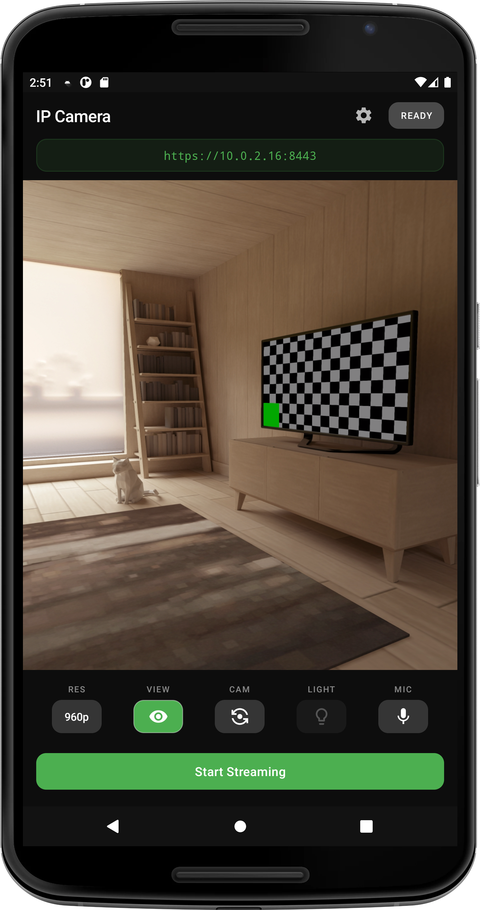
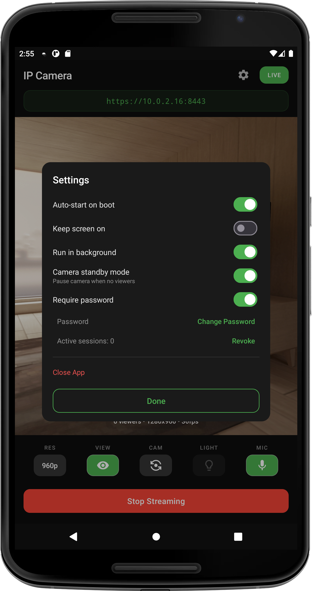

# Android IP Camera

An Android app converting phones into network IP cameras with **AI-powered detection**, H.264/MJPEG streaming, bidirectional audio, and event history. Operates entirely on local networks—no cloud services, accounts, or subscriptions required.

Designed for older devices (Android 7.0+) to repurpose outdated phones responsibly.

<p align="left">
  
  
</p>

## How It Works

The app runs a web server directly on your phone. When you tap Start Streaming, it serves a web page any browser on your network can access. Video streams via H.264 (efficient, low bandwidth) or MJPEG (universal browser compatibility). Audio, settings, and detection events use WebSocket connections. Everything remains local—no external data transmission.

## Features

### AI-Powered Detection

**On-device machine learning** for intelligent monitoring—no cloud required, no subscription fees.

- **Dog Bark Detection** using YAMNet ML model
- **Baby Cry Detection** using YAMNet ML model
- Individual enable/disable toggles for each classifier
- Adjustable confidence thresholds (1-100%)
- Real-time event notifications via WebSocket
- Classification-specific event tracking and history
- Privacy-focused: all ML inference runs locally on your device

### Event History & Timeline

**Never miss what happened** while you were away. Events are stored locally on your device.

- Configurable retention period (7-90 days, default 30 days)
- Activity timeline visualization with three view modes:
  - **Overview**: Hourly activity blocks for quick daily summary
  - **Detail**: 10-minute bins for precise event timing
  - **Sparkline**: Compact view for at-a-glance monitoring
- Per-event-type tracking (Motion, Any Sound, Dog Bark, Baby Cry)
- Recent events list with timestamps and detection details
- Clear event history functionality
- Local storage—complete privacy, no cloud uploads

### Video Streaming

- H.264 hardware encoding with MJPEG fallback
- Dynamic resolution selection from camera capabilities
- Configurable frame rate (1-60 FPS)
- Quality slider for JPEG compression and H.264 bitrate (20-100)
- Multi-camera support (front, back, wide, telephoto, macro)
- Torch/flashlight control
- Per-viewer rotation settings (0°, 90°, 180°, 270°)

### Snapshots

- Quick snapshot from current video stream (`/snapshot`)
- High-resolution still capture at full sensor resolution (`/capture`)
- Automatic download to browser
- Proper orientation applied

### Two-Way Audio

- Live microphone streaming from phone to browser
- Push-to-talk from browser to phone speaker
- Text-to-speech capability for voice announcements
- Audio level monitoring and visualization
- Configurable audio quality and buffering

### Motion & Sound Detection

**Basic detection** for general monitoring (in addition to AI-powered classifiers).

- Motion detection with Y-plane frame differencing
- Any Sound detection with RMS/dB threshold analysis
- Adjustable sensitivity (1-10 scale)
- Configurable cooldown between alerts (0-30 seconds)
- Real-time event notifications via WebSocket
- Event history integration

### 24/7 Operation

**Run continuously** without user intervention.

- Auto-start on boot with device-specific setup guidance (OnePlus, Samsung, etc.)
- Background mode—camera runs with screen off
- Run in background toggle for uninterrupted operation
- Keep screen on option for dedicated camera devices
- Preview visibility toggle to save battery
- CPU throttling—auto-reduces FPS when CPU > 15%
- Thermal throttling with progressive FPS reduction (38°C/42°C/48°C thresholds)
- Adaptive throttle recovery when conditions normalize
- Camera standby mode—0% CPU usage when no viewers connected
- Battery optimization exemption guidance

### Security

**Local network security** with flexible authentication options.

- HTTPS with auto-generated self-signed certificates
- **Certificate Installation**: Download and install certificate to eliminate browser warnings permanently
  - One-click certificate download from dashboard
  - Certificate regeneration when IP address changes
  - Automatic validity maintenance
- Optional password protection
- Session tokens with 7-day expiry and auto-refresh
- Rate limiting: 5 failed login attempts → 30-second lockout
- Salted SHA-256 password hashing with per-device salt

> **Security note:** Only use on trusted networks (home WiFi). On public WiFi (coffee shops, airports, etc.), other users on the same network may be able to access your camera stream.

## Web Dashboard

Access the camera from any network browser. The dashboard provides full control without requiring the app open.

**Video & Camera Controls:**
- Stream type toggle (H.264/MJPEG)
- Resolution, frame rate, and quality sliders
- Camera switching (front, back, and other available cameras)
- Rotation control per viewer (0°, 90°, 180°, 270°)
- Torch/flashlight toggle
- Snapshot and high-resolution capture buttons
- Fullscreen mode with overlay controls

**AI Detection & Event Management:**
- Enable/disable dog bark and baby cry detection
- Confidence threshold sliders for each classifier
- Activity timeline with switchable view modes
- Recent events browser with timestamps and details
- Clear event history options
- Real-time detection notifications

**Audio & Communication:**
- Push-to-talk button for two-way audio
- Text-to-speech message input
- Microphone streaming toggle
- Audio level visualization

**Security & Settings:**
- HTTPS certificate download and installation
- Password authentication management
- Real-time settings sync between app and dashboard
- Session management

**System Monitoring:**
- Debug panels for system info (CPU, memory, battery, temperature)
- Encoder statistics (bitrate, frame count, mode)
- WebSocket connection status
- Viewer count

**Design:**
- Mobile-responsive dark theme
- Optimized for phones, tablets, and desktop browsers


## Installation

1. Download the latest APK from [Releases](https://github.com/famesjranko/ip-camera-releases/releases)
2. Install on your Android device (allow installation from unknown sources if prompted)
3. Open the app and grant camera and microphone permissions

## Usage

### Starting the Camera

1. Open the app and tap **Start Streaming**
2. Note the displayed URL (e.g., `https://192.168.1.100:8443`)

### Viewing the Stream

1. Open a web browser on any device on the same network
2. Navigate to the URL shown in the app
3. **First time**: Install the security certificate
   - Click the certificate download button in the dashboard, or
   - Visit `/cert` endpoint (e.g., `https://192.168.1.100:8443/cert`)
   - Install the downloaded certificate on your device/browser
   - Eliminates security warnings permanently
   - Alternative: Click "Advanced" → "Proceed" each time (not recommended)

### Enabling AI Detection

1. In the web dashboard, scroll to "Detection Settings"
2. Enable "Dog Bark Detection" or "Baby Cry Detection"
3. Adjust confidence thresholds (lower = more sensitive, higher = fewer false positives)
4. Set cooldown period between detections
5. View detected events in the "Recent Events" section
6. Check the activity timeline to see when events occurred

### Reviewing Event History

1. Open the dashboard
2. Scroll to "Activity Timeline" card
3. Switch between Overview/Detail/Sparkline view modes
4. Review recent events by type (Motion, Sound, Dog Bark, Baby Cry)
5. Clear old events as needed

## Requirements

- Android 7.0 or higher (API 24)
- Camera and microphone permissions
- WiFi network
- For AI detection: Device with sufficient CPU (most devices from 2016+ work fine)

## Browser Support

**H.264 Streaming** uses the WebCodecs API, requiring:
- A browser supporting WebCodecs (Chrome 94+, Edge 94+, Opera 80+)
- Secure context (HTTPS or localhost)

If H.264 isn't available, the dashboard automatically falls back to MJPEG, which works in all browsers.

**AI Detection** works on all browsers—detection runs on the Android device, not in the browser.

## API Endpoints

| Endpoint | Method | Description |
|----------|--------|-------------|
| `/` | GET | Web dashboard (HTML) |
| `/stream` | GET | MJPEG video stream |
| `/snapshot` | GET | Single JPEG frame from current stream |
| `/capture` | GET | High-resolution still capture (full sensor resolution) |
| `/settings` | GET/POST | Settings JSON (get current settings or update) |
| `/capabilities` | GET | Camera capabilities (available resolutions, cameras) |
| `/status` | GET | Server status (streaming state, viewer count, uptime) |
| `/cert` | GET | Download HTTPS certificate (PEM format) |
| `/cert/info` | GET | Certificate metadata (JSON: subject, issuer, validity) |
| `/cert/regenerate` | POST | Regenerate certificate with current IP address |
| `/ws` | WebSocket | WebSocket endpoint for real-time communication |

## WebSocket Protocol

The WebSocket endpoint (`/ws`) provides bidirectional real-time communication for settings, audio, detection events, and H.264 video frames.

### Client → Server Messages

```json
{ "type": "setting", "key": "resolution", "value": "1280x720" }
{ "type": "audio", "data": "<base64 PCM 16kHz mono>" }
{ "type": "tts", "message": "Hello from the dashboard" }
{ "type": "enableH264", "enable": true }
{ "type": "stream_control", "action": "start" }
{ "type": "stream_control", "action": "stop" }
{ "type": "capture" }
{ "type": "ping" }
{ "type": "auth", "password": "your-password" }
```

### Server → Client Messages

```json
{ "type": "status", "streaming": true, "fps": 28, "viewerCount": 2, ... }
{ "type": "settings", "data": { "resolution": "1920x1080", ... } }
{ "type": "audio", "data": "<base64 PCM 16kHz mono>" }
{ "type": "system_info", "cpu": 15, "memory": 45, "batteryTemp": 32, ... }
{ "type": "capture_ready", "url": "/capture", "width": 4032, "height": 3024 }
{ "type": "motion_detected", "eventId": 1, "changePercent": 5.2, "timestamp": 1234567890 }
{ "type": "sound_detected", "eventId": 2, "db": -25.5, "rms": 0.05, "timestamp": 1234567890 }
{ "type": "dog_bark_detected", "eventId": 3, "confidence": 0.87, "timestamp": 1234567890 }
{ "type": "baby_cry_detected", "eventId": 4, "confidence": 0.92, "timestamp": 1234567890 }
{ "type": "auth_required" }
{ "type": "auth", "success": true, "token": "..." }
```

**H.264 Video Frames**: Sent as **binary WebSocket frames**.

## Performance

- **Zero-copy Surface mode**: Camera → H.264 encoder direct, ~50% CPU reduction
- **Per-client frame queues**: Slow clients don't block others
- **Hardware acceleration**: Camera2 API, MediaCodec, RenderScript, TextureView
- **CPU throttling**: Auto-reduce FPS when CPU > 15%
- **Thermal throttling**: Progressive FPS reduction at 38°C/42°C/48°C
- **Adaptive recovery**: Restores frame rate when conditions normalize
- **Pooled buffers**: Reusable byte arrays eliminate GC pressure
- **On-device ML**: YAMNet inference optimized for mobile CPUs

## FAQ

**Does it work outside my home network?**
Not directly. You'd need port forwarding or a VPN. For security reasons, we don't recommend exposing the camera to the public internet.

**Does it record video?**
No. Streaming is live only; video is not stored. However, detection events (motion, sound, dog barks, baby cries) are stored in the event history database for 7-90 days (configurable).

**Why the security warning in my browser?**
The app uses a self-signed certificate for HTTPS. **Solution**: Download and install the certificate from the dashboard (one-time setup). This eliminates warnings permanently. See Usage section above.

**Can I run multiple cameras?**
Yes. Install on multiple phones and open each URL in a separate browser tab.

**How do I stop the false dog bark detections?**
Increase the confidence threshold in the detection settings. Higher values (80-100) reduce false positives but may miss some real barks. Adjust based on your environment.

**Does AI detection drain the battery?**
ML inference uses some CPU, but the app includes thermal throttling and CPU monitoring to prevent overheating. On most devices (2016+), dog bark and baby cry detection add ~5-10% CPU usage.

**Where is the event history stored?**
Locally on your Android device in a SQLite database. Events are never sent to the cloud. You can configure retention (7-90 days) or clear history manually.

**Can I use this for outdoor monitoring?**
Yes, as long as the phone has WiFi connectivity and power. Thermal throttling helps prevent overheating in direct sunlight, but prolonged outdoor use is not officially supported.

## Issues

Bug reports and feature requests: [Issue Tracker](https://github.com/famesjranko/ip-camera-releases/issues)
