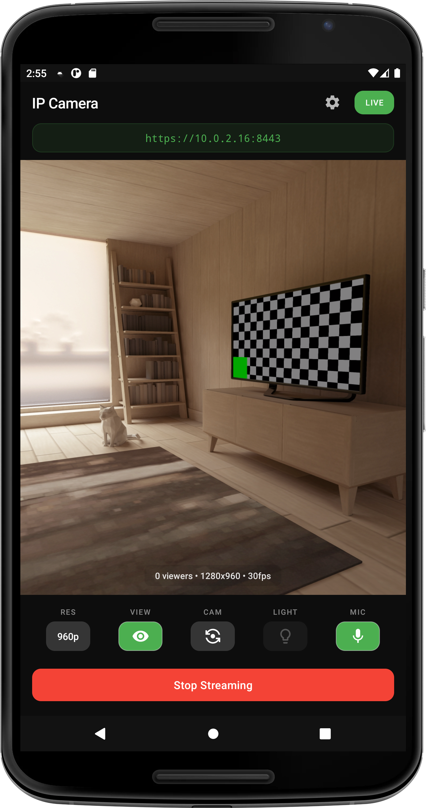
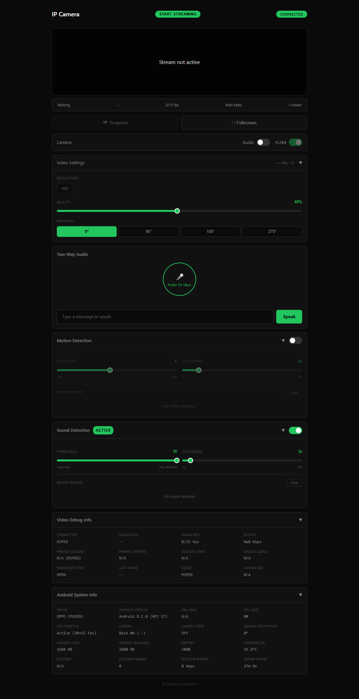

# Android IP Camera

An Android app that turns a phone into a network IP camera with H.264/MJPEG streaming, two-way audio, and motion/sound detection. Runs entirely on your local network - no cloud, no accounts, no subscriptions.

Designed to work on older devices (Android 7.0+) so you can repurpose that old phone instead of throwing it away.

## How It Works

The app runs a web server directly on your phone. When you tap "Start Streaming", it starts serving a web page that any browser on your network can access. The video is streamed in real-time using either H.264 (efficient, low bandwidth) or MJPEG (compatible with all browsers). Audio, settings, and detection events are handled over a WebSocket connection.

Everything stays on your local network - no data leaves your home, no accounts to create, no cloud services involved.

## Features

**Video Streaming**
- H.264 hardware encoding with MJPEG fallback
- Configurable resolution, frame rate, and quality
- Multi-camera support (front, back, wide, telephoto, macro)
- Torch/flashlight control

**Snapshots**
- Quick snapshot from current video stream
- High-resolution still capture (full sensor resolution, separate from video)
- Proper orientation applied

**Two-Way Audio**
- Live microphone streaming from phone
- Push-to-talk from browser to phone speaker
- Text-to-speech - type a message, phone speaks it

**Motion & Sound Detection**
- Motion detection with adjustable sensitivity (1-10)
- Sound detection with dB threshold (1-10)
- Configurable cooldown between alerts
- Real-time event notifications in dashboard

**24/7 Operation**
- Auto-start on boot
- Background mode (runs with screen off)
- CPU/thermal throttling (reduces frame rate when hot)
- Camera standby mode (keeps camera warm for instant response)

**Security**
- HTTPS with auto-generated certificates
- Optional password protection

## Web Dashboard

Access the camera from any browser on your network. The dashboard provides full control without needing the app open.

- **Video controls** - resolution, frame rate, quality, H.264/MJPEG toggle
- **Camera switching** - front, back, and any other available cameras
- **Two-way audio** - push-to-talk button and text-to-speech input
- **Motion & sound detection** - enable/disable, adjust sensitivity, view recent events
- **Snapshots** - capture stills from the stream or full-resolution from sensor
- **Settings sync** - changes reflect instantly on both app and dashboard
- **Per-viewer preferences** - rotation and audio settings are local to each viewer
- **Debug panels** - system info, encoder stats, video debug info
- **Fullscreen mode** - clean view with overlay controls
- **Mobile-responsive** - works on phones, tablets, and desktops

## Installation

1. Download the APK from [Releases](https://github.com/famesjranko/ip-camera-releases/releases)
2. Install on your Android device
3. Grant camera and microphone permissions

## Usage

1. Open the app and tap **Start Streaming**
2. Note the URL displayed (e.g., `https://192.168.1.100:8443`)
3. Open that URL in a browser on the same network

## Requirements

- Android 7.0 or higher (API 24)
- Camera and microphone permissions
- WiFi network

## Browser Support

H.264 streaming uses the WebCodecs API, which requires:
- A browser that supports WebCodecs (check: does `VideoDecoder` exist?)
- A secure context (HTTPS or localhost)

If H.264 isn't available, the dashboard automatically falls back to MJPEG which works in all browsers.

## FAQ

**Does it work outside my home network?**
Not directly. You'd need port forwarding or a VPN.

**Does it record video?**
No. Streaming is live only. Nothing is stored.

**Why the security warning in Chrome?**
The app uses a self-signed certificate for HTTPS. Click "Advanced" → "Proceed" to continue.

**Can I run multiple cameras?**
Yes. Install on multiple phones and open each URL in a separate tab.

## Issues

Bug reports and feature requests: [Issue Tracker](https://github.com/famesjranko/ip-camera-releases/issues)

## License

MIT
